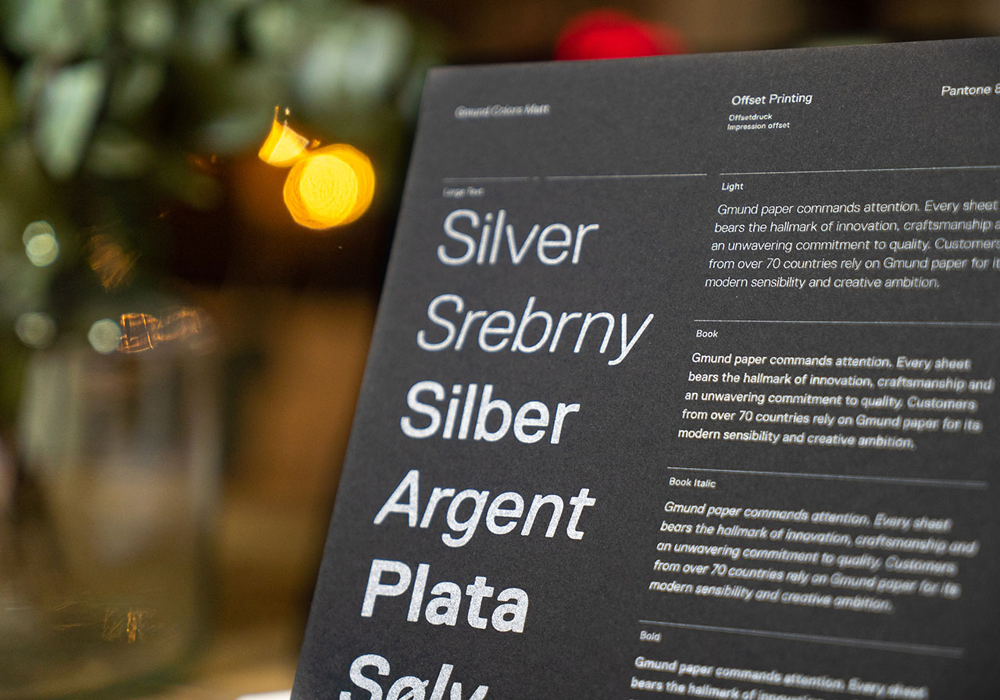

<p align="center">
  
</p>

# AB Test App Typography

A/A/B test measuring the impact of typography changes on user behavior. 

Conversion funnel analysis and statistical validation included.

### Contents
- `notebooks/ab_test_typography.ipynb` — Jupyter notebook with data preprocessing, funnel, and tests.
- `reports/` — Plots of conversion rates and test results.
- `.gitignore`

### How to Reproduce
1. Clone this repository:
   ```bash
   git clone https://github.com/tu_usuario/ab-test-app-typography.git
   cd ab-test-app-typography```
2. Install dependencies:
    ```pip install -r requirements.txt```
3. Open and run the notebook in `notebooks/`.

### Results
- No significant differences between control groups (A/A).
- Typography change (B) had no negative effect on conversions.
- Conversion funnel stable: page → cart → purchase.

